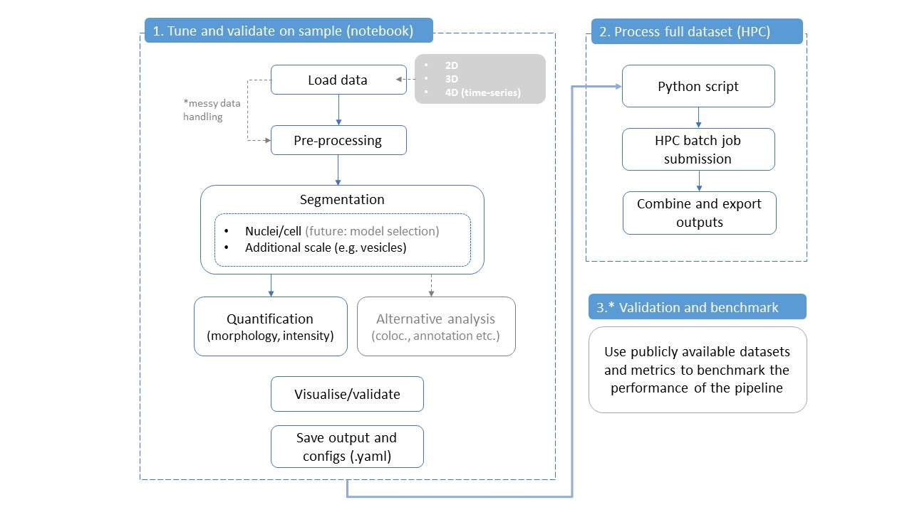

# Image-Analysis-Summer-Project

This project aims to develop a flexible, modular, and user-friendly image analysis pipeline for biological microscopy data, with a focus of this branch on 3D confocal images (e.g. .tiff stacks). The workflow supports segmentation, quantification, and potential future downstream analyses such as colocalisation, all first tunable via interactive notebooks and then scalable for batch processing on HPC.

## Planned workflow

### Core workflow:
1. **Interactive image loading** and visualisation via Napari (?).
2. **3D segmentation** using tools like Cellpose, StarDist, or other methods.
3. **Quantification** of structures (volume, intensity, position, etc.).
4. Optional **finer scale segmentation** (e.g. for vesicles inside cells).
5. Export results and configuration for HPC batch processing.

- Users explore a notebook-based interface to test segmentation and tune parameters on a small image subset
- Configs (parameters) are automatically exported to a structured .yaml file and saved at `configs` with a new name.
- A Python script (main.py) uses this config to process larger batches on the HPC
- All modules (notebook, HPC jobs) share the same core functions from `scripts` to ensure consistency

## Branching logic
The project can be further extended by following the branching logic outlined below. All additions should be modular and easily integrable into the existing framework.

## Project structure
This branch has the following structure:

<pre lang="text"><code> Image-Analysis-Summer-Project/ ├── notebooks/ # Interactive tuning/testing notebooks │ └── prototype_3d_pipeline.ipynb ├── scripts/ # Core functions (I/O, segmentation, quantification, config, etc.) │ ├── io_utils.py │ ├── segmentation.py │ ├── quantification.py │ └── config_handler.py ├── configs/ # YAML config files (also exportable from notebook) │ └── example_config.yaml ├── jobs/ # HPC execution scripts │ ├── run_pipeline_3d.sh │ └── main.py ├── outputs/ # Results obtained from the notebook │ ├── example_quantification.csv │ └── example_mask.tiff ├── inputs/ # Example dataset used │ └── example_images/ ├── project_plan_workflow.jpg # Diagram showing full project workflow ├── image.png # Branching logic table └── requirements.txt # Conda environment </code></pre>

The interactive notebook in `notebooks` should serve as a user-friendly tool to tune and validate a small subset of the data.
`scripts` contains all the functions used in the notebook, as well as in the python scipt (`main.py`) to run the job array on HPC. 
`jobs` contains a script (`run_pipeline_3d.sh`) that will submit the same work to Myriad via a `main.py` script.
`configs` contains a template of the configuration file with parameters that could be adjusted and saved through an interactive notebook.

### Datasets
We will use a combination of [publicly available benchmark datasets](https://bbbc.broadinstitute.org/image_sets) and data generated within Biosciences to test and demonstrate pipelines. 

There are a range of datasets on there, including [3D datasets](https://bbbc.broadinstitute.org/search/3D?) that look quite friendly ([e.g.](https://bbbc.broadinstitute.org/BBBC050). *Dataset will be specified in the /input/example_images/ folder*

### Requirements
[conda environments](https://docs.conda.io/projects/conda/en/latest/user-guide/getting-started.html#managing-python). Once you have made an env and installed packages, export the list of packages with `conda env export --no-builds > requirements.txt`. This means anyone can recreate the envirornment with `conda env create -f requirements.txt` 

## Quick start
To be completed — instructions for setting up the environment, running the notebook, and launching jobs on HPC
