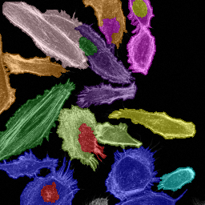
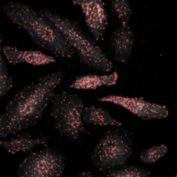
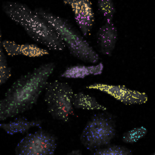
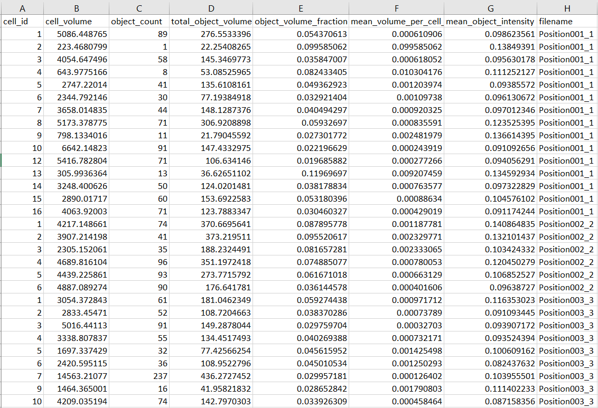

# Image-Analysis-Summer-Project

This project aims to develop a flexible, modular, and user-friendly image analysis pipeline for biological microscopy data, with a focus of this branch on 3D confocal images (e.g. .tiff stacks). The workflow supports segmentation, quantification, and potential future downstream analyses such as colocalisation, all first tunable via interactive notebooks and then scalable for batch processing on HPC.

Currently it supports:
- Preprocessing of raw 3D image volumes (.tif only)  
- Nuclear segmentation (StarDist3D / Cellpose)  
- Cytoplasm segmentation (intensity- or membrane-based watershed)  
- Intracellular structure segmentation (AllenCell workflows: spotty, filamentous, etc.)  
- Per-cell quantification of object features (count, volume, intensity, centroid distance), exported as .csv files  
- Quality-control visualizations (MIP overlays, labeled masks, per-cell mappings)  

The pipeline is implemented as a combination of **scripts** (for reproducibility and modularity) and a **notebook** (for exploration and tuning).  


## Planned workflow

### Core workflow:


- Users explore a notebook-based interface to test segmentation and tune parameters on a small image subset
- Configs (parameters) are automatically exported to a structured .yaml file and saved at `configs` with a new name.
- A Python script (main.py) uses this config to process larger batches on the HPC
- All modules (notebook, HPC jobs) share the same core functions from `scripts` to ensure consistency

### Branching logic
The project can be further extended by following the branching logic outlined below. All additions should be modular and easily integrable into the existing framework.


### Project structure
This branch has the following structure:

```text
Image-Analysis-Summer-Project/
├── configs/                     # YAML conda environments and config files
│   ├── 3d_image_segm_env_hpc.yml
│   ├── 3d_image_segm_env_local.yml
│   └── example_config.yaml
├── docs/                        # Documentation and notes
├── input_data/data_used.txt     # Description of dataset used
├── notebooks/                   # Interactive tuning/testing notebooks
│   ├── 3d_multichannel_analysis.ipynb      # Main notebook for multichannel image processing 
│   └── 3d_segmentation_prototype.ipynb     # Notebook prototype with 3d nucleus segmentation
├── scripts/                     
│   ├── io_utils.py              # Input/output helpers
│   ├── segmentation.py          # Nuclear + cytoplasm segmentation
│   ├── quantification.py        # Object quantification, voxel size operations
│   └── pre_processing.py        # Preprocessing utilities
├── jobs/                        # HPC execution scripts (to be completed)
│   ├── run_pipeline_3d.sh
│   └── main.py
└── models/stardist-models/3d_demo          # Local version of StarDist model
   
```

The interactive notebook in `notebooks` should serve as a user-friendly tool to tune and validate a small subset of the data.
`scripts` contains all the functions used in the notebook, as well as in the Python script (`main.py`) to run the job array on HPC. 
`jobs` contains a script (`run_pipeline_3d.sh`) that will submit the same work to Myriad via a `main.py` script.
`configs` contains a template of the configuration file with parameters that could be adjusted and saved through an interactive notebook.


### Datasets
We will use a combination of [publicly available benchmark datasets](https://bbbc.broadinstitute.org/image_sets) and data generated within Biosciences to test and demonstrate pipelines. 


The latest 3d multichannel dataset used for developing a pipeline can be found here: [EBI BioImage Archive: S-BIAD1272](https://www.ebi.ac.uk/biostudies/bioimages/studies/S-BIAD1272?query=3D%2C%20confocal). Note, that this dataset is available as multi-well experiment in LIF format. In order to use the data, .lif files were converted to .tif files, using Macro_tiff.ijm (**Instructions to be added**). 

```
mkdir -p input_data # make sure you are in the folder above the Git project folder
cd input_data
wget https://ftp.ebi.ac.uk/biostudies/fire/S-BIAD/272/S-BIAD1272/Files/SingleCellImageQuant/30min_stimulation.zip 
unzip 30min_stimulation.zip -d raw/
rm 30min_stimulation.zip
```
This will load several LIF files for different conditions, the one used here is `240109_240110_S1_30min_pMAPK_EGF`. This needs to be further processed with macro to be converted to TIFF and to extract ~24 separate single-position images per LIF.

Alternatively, the ready-to-use dataset (in .tif) could be found here: [240109_240110_S1_30min_pMAPK_EGF](https://liveuclac-my.sharepoint.com/:f:/r/personal/ucbtvsi_ucl_ac_uk/Documents/Documents/Lada/30min_stimulation/240109_240110_S1_30min_pMAPK_EGF?csf=1&web=1&e=6WyTO2). However, this may require an additional access request to open OneDrive folder.

#### Voxel Size
A voxel is the three-dimensional equivalent of a pixel, representing a small cube of the imaged sample. The voxel size specifies the physical dimensions of each voxel (e.g. in micrometres) along the x, y, and z axes. Knowing the voxel size is critical for 3D image analysis because it allows correction for anisotropy between axes, ensures that Gaussian smoothing and other filters operate at the right physical scale, and makes results comparable across datasets. Users must obtain the voxel size from their image metadata or acquisition settings before running the analysis.

### Requirements
- Python 3.8+
- conda
- `configs/3d_image_segm_env_hpc.yml` for running on HPC (Myriad, UCL) 
    or `configs/3d_image_segm_env_local.yml` for local machine (Windows)

Main dependecies, inlcuded in the conda envs:
- `numpy` (IMPORTANT: to avoid clushes, make sure numpy>=1.24,<2.0), `pandas`, `scikit-image`, `scipy`
- `stardist`, `cellpose`, `aicssegmentation`
- `matplotlib`, `tifffile`, `ipykernel` 


## Quick start

To use the pipeline, you need:

1. Clone the repository (detailed instructions at the cellpose-pipeline-testing branch) and `git checkout 3d-image-segmentation-pipeline` to move to this branch of the repository

2. Create a conda environment
    - for HPC (Myriad) use:
        - Load conda module
            ```
            module load python/miniconda3
            source $UCL_CONDA_PATH/etc/profile.d/conda.sh
            ```
         - *Sometimes you might need to activate the existing conda env in order to proceed to the next steps `source my_env/bin/activate`
         - Create and activate a new hpc environmnet from corresponding .yml file
            ```
            conda env create -f 3d_image_segm_env_hpc.yml -n 3d-image-segm-env-hpc 
            conda activate 3d-image-segm-env-hpc
            ```
        - Register new environment as a Jupyter kernel `python -m ipykernel install --user --name=3d-image-segm-env-hpc`

    - for local machine:
        - Create and activate a new local environmnet from corresponding .yml file
            ```
            conda env create -f 3d_image_segm_env_local.yml -n 3d-image-segm-env-local
            conda activate 3d-image-segm-env-local
            ```
        - Select this environment as a kernel in Jupyter notebook

3. Open `notebooks/3d_multichannel_analysis.ipynb`, where the main pipeline is demonstrated, and follow the steps:
    - Loading images from multichannel TIFFs
    - Preprocessing (normalization, optional downsampling)
    - Nucleus segmentation
    - Cytoplasm segmentation
    - Organelle segmentation
    - Quantification of objects
    - Export results as .csv

### Example output

- Nuclear and cytoplasm masks overlaid on raw images + .tif labelled mask

<p align="center">
  
  
</p>


- Organelle segmentation (e.g. spotty structures) .tif binary mask and MIP overlay + organelle object-to-cell assignment labelled mask

<p align="center">
  
  
</p>


- Per-cell quantification table (CSV) 

 <p align="center">
  
</p>


## Credits
This pipeline utilises and builds upon:

- [StarDist3D](https://github.com/stardist/stardist)
- [CellPose](https://github.com/mouseland/cellpose)
- [Allen Cell Segmentation workflows](https://www.allencell.org/segmenter.html#lookup-table)
- [scikit-image](https://scikit-image.org/docs/0.25.x/api/skimage.html)
