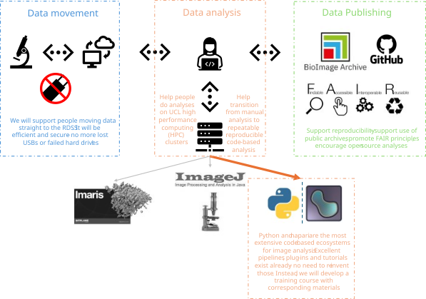

# Image-Analysis-Summer-Project
Repo for hosting key info for the summer placement: plan, resources, progress, outputs

## Background
Analysing bioimage data is becoming increasingly complex. File sizes, the number of images and samples, and complex algorithms require specialised knowledge.

Resources are required to support researchers handling complex datasets and analysis techniques.

In particular, many efficient and reproducible workflows are implemented in coding languages, such as python, which can be a barrier for researchers without coding experience.

Through this project, we will develop resources to help researchers run python-based image analysis workflows.

## A reproducible workflow
Our resources will demonstrate a robust and reproducible workflow, from data generation to data publishing. This covers three main themes:
1. Data management - store and transfer data securely
2. Data analysis - robust and reproducible analyses
3. Data publishing - promote FAIR principles through good practice when publishing results

### Data Management
Transfer data and confirm with md5
Store on RDSS

### Data Analysis
Use scripting approach to generate repeatable, reproducible workflows.

Configure workflows without needing to change code. I.e. through config files. Make it accessible to non-coders.

Validate pipeline outputs by using test datasets with expected results.

Job scripts for running analyses on HPC clusters, again with minimal coding experience needed.

### Data Publishing
Demo of how to upload to archives, how to generate Zenodo DOI, what is needed for reproducibility (annotated code, environments etc).

## Image Analysis
We will generate resources for common analysis steps e.g. segmentation (2D and 3D), counting cells/nuclei, shape/size analysis, quantifying light intensity.

## Datasets
We will use a combination of [publicly available benchmark datasets](https://bbbc.broadinstitute.org/image_sets) and data generated within Biosciences to test and demonstrate pipelines.

By running on different datasets, we will generate recommendations for a range of challenges and problems. Important as tutorials often only run on a single, simple test dataset.

## Collaboration
We happily will have a team of people working on this project. It would be good for all contributors to read [this tutorial](https://vickysteeves.gitlab.io/collaborating-with-git/collaborating-with-git.html) before starting.

### Environments
To make sure we can all run the same code on our own machines, we will use [conda environments](https://docs.conda.io/projects/conda/en/latest/user-guide/getting-started.html#managing-python). Once you have made an env and installed packages, export the list of packages with `conda env export --no-builds > requirements.txt`. This means anyone can recreate the envirornment with `conda env create -f requirements.txt` and we can all work happily and reproucibly! 

### Branches
The repo has a few branches to be aware of:
- `Main` is for recording key info about the project. No code on here yet.
- `image-segmentation-cellpose-demo` contains an example of how these projects might look for segmenting 2D data. See the notebook in `notebooks` for example of how a guide might look. `scripts` contains all the functions used in the notebook. `jobs` contains a script (`run_segmentation.sh`) that will submit the same work to myriad via a `main.py` script.
- I think Lada will start a new branch for her work - adding an issue now.

### Some important tips
- Clone the repository and make the conda environments first.
- We will organise tasks in the Issues tab. Share updates and questions there. Assign tasks to yourself if you are working on something.
- Don't commit directly to any of the branches above. These will be kept "clean" i.e. only include code that works.
- Make a new branch for any work you are doing. Be careful to branch _from_ the branch you want to work on.
- Keep branches focussed - one feature per branch. e.g. "adding myriad script". Try to only edit code relevant to the aim of the branch.
- Make your changes, check it all runs, push back to the dedicated branch on the repo, and open a Pull Request to merge with the relevant branch.
- Pull regularly to stay up to date
- Write clear messages so everyone can see what changes you've made

## Impact
Others can use it
